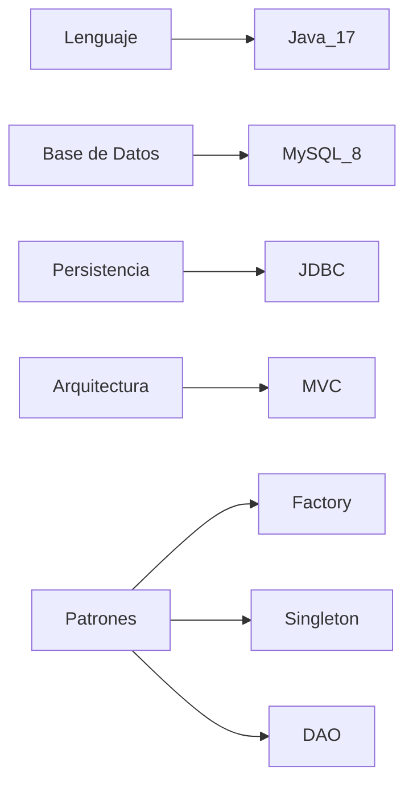

<div align="center">

#  TecnoStore  
**Sistema de Gestión de Ventas de Celulares 📱**


---

 **MARÍA ALEJANDRA GÓMEZ ARCHILA**  
 **2026 - Proyecto POO + JDBC**


</div>

---

##  Descripción General

**TecnoStore** es un **Sistema de Gestión de Ventas** completo y profesional, diseñado para **automatizar el control de inventario, clientes y ventas** de una tienda minorista de celulares.

Este proyecto permite a la empresa **TecnoStore** migrar de hojas de cálculo manuales a un sistema robusto que incluye:

-  Gestión completa de celulares por marca y gama  
-  Registro de clientes con validaciones  
-  Procesamiento de ventas con IVA automático  
-  Reportes dinámicos con Stream API  
-  Persistencia total en MySQL  

>  **Proyecto académico que demuestra dominio de POO, JDBC, patrones de diseño y buenas prácticas en Java.**

---

##  Características Principales

|  Módulo |  Funcionalidades |
|-----------|------------------|
| **Gestión de Celulares** |  CRUD completo: registrar, actualizar, eliminar, listar por marca y gama |
| **Gestión de Clientes** |  Registro con validación de correo e identificación única |
| **Gestión de Ventas** |  Proceso completo: selección de productos, cálculo de IVA (19%), actualización automática de stock |
| **Reportes Inteligentes** |  Stock bajo, Top 3 más vendidos, ventas por mes (Stream API) |
| **Persistencia JDBC** |  6 tablas relacionales en MySQL con integridad referencial |
| **Patrones de Diseño** |  Factory (creación de celulares), Singleton (conexión BD), DAO (acceso a datos) |
| **Excepciones Personalizadas** |  Validaciones robustas con manejo de errores específicos |

---

##  Tecnologías Utilizadas



###  Stack Tecnológico

- **Lenguaje:** Java 17+ (POO, Stream API, try-with-resources)
- **Base de Datos:** MySQL 8.0
- **Driver:** MySQL Connector/J 8.x
- **Arquitectura:** MVC (Model-View-Controller)
- **Patrones:** Factory, Singleton, DAO
- **Herramientas:** IDE (IntelliJ IDEA / Eclipse / NetBeans)

---

##  Instalación y Uso

Sigue estos pasos para ejecutar el proyecto localmente :

###  Requisitos Previos

-  Java JDK 8 o superior instalado
-  MySQL 8.0 o superior
-  MySQL Connector/J (driver JDBC)
-  IDE de Java (recomendado: IntelliJ IDEA, Apache NetBeans IDE 25)

###  Pasos de Instalación

```bash
# 1. Clonar el repositorio
git clone https://github.com/gamaz-19/TecnoStore_GomezMaria.git

# 2. Entrar al directorio del proyecto
cd TecnoStore_GomezMaria

# 3. Crear la base de datos en MySQL
mysql -u root -p < tecnostore.sql

# O desde el cliente MySQL:
source /ruta/al/archivo/tecnostore.sql;
```

### Configurar Conexión a MySQL

Edita el archivo `src/Controller/ConexionDB.java` con tus credenciales:

```java
private static final String URL = "jdbc:mysql://localhost:3306/tecnostore";
private static final String USUARIO = "root";          // Tu usuario MySQL
private static final String CONTRASENA = "tu_password"; // Tu contraseña
```

###  Compilar y Ejecutar

```bash
# Opción 1: Desde IDE
# Abre el proyecto en tu IDE favorito y ejecuta Main.java


---

##  Estructura del Proyecto

```
📁 TecnoStore/
├── 📁 Source Packages/
│   ├── 📁 Controller/
│   │   ├── ConexionDB.java         # Singleton - Conexión única a MySQL
│   │   └── gestionVentas.java      # Coordinador de operaciones de venta
│   │
│   ├── 📁 Model/
│   │   ├── Celular.java            # Entidad Celular (composición con Marca)
│   │   ├── Cliente.java            # Entidad Cliente
│   │   ├── Detalle_venta.java      # Detalle de cada línea de venta
│   │   ├── Marca.java              # Entidad Marca (tabla separada)
│   │   ├── Persona.java            # Clase base para Cliente (herencia)
│   │   └── Venta.java              # Entidad Venta (composición con items)
│   │
│   ├── 📁 Persistence/
│   │   ├── CelularCRUD.java        # DAO - CRUD de celulares + JOIN con marca
│   │   ├── ClienteCRUD.java        # DAO - Gestión persona + cliente
│   │   ├── DetalleVentaCRUD.java   # DAO - Detalles de venta
│   │   ├── MarcaCRUD.java          # DAO - Gestión de marcas
│   │   ├── PersonaCRUD.java        # DAO - Operaciones de persona
│   │   └── VentaCRUD.java          # DAO - Gestión de ventas
│   │
│   ├── 📁 Utilities/
│   │   ├── ReportUtils.java        # Reportes con Stream API
│   │   ├── UtilsFile.java          # Generación de reporte_ventas.txt
│   │   └── Validador.java          # Validaciones (precio, stock, correo)
│   │
│   └── 📁 View/
│       ├── Main.java [-/D]         # Punto de entrada del sistema
│       ├── MenuCelulares.java      # Menú gestión de celulares
│       ├── MenuClientes.java       # Menú gestión de clientes
│       ├── MenuPrincipal.java      # Menú principal del sistema
│       ├── MenuReportes.java       # Menú de reportes
│       └── MenuVentas.java         # Menú realizar venta
│
├── tecnostore.sql                  # Script creación BD + datos prueba
├── reporte_ventas.txt              # Reporte generado automáticamente
└── README.md                       # Esta documentación
```

---

##  Base de Datos MySQL

### Estructura de Tablas

El sistema utiliza **6 tablas relacionales** con integridad referencial:

####  Diagrama de Relaciones

```
┌─────────┐         ┌──────────┐
│  marca  │────<    │ celular  │
└─────────┘         └──────────┘
                         │
                         │
┌─────────┐         ┌──────────┐         ┌───────────────┐
│ persona │────<    │ cliente  │    >────│     venta     │
└─────────┘         └──────────┘         └───────────────┘
                                               │
                                               │
                         ┌──────────┐          │
                         │ celular  │    >─────┤
                         └──────────┘          │
                                               │
                                        ┌──────────────┐
                                        │detalle_venta │
                                        └──────────────┘
```

####  Tablas Principales

| Tabla | Descripción | Campos Clave |
|-------|-------------|--------------|
| **marca** | Marcas de celulares | `id` (PK), `nombre` |
| **celular** | Catálogo de productos | `id` (PK), `id_marca` (FK), `modelo`, `stock`, `sistemaOperativo`, `gama`, `precio` |
| **persona** | Información base de personas | `id` (PK), `nombre`, `identificacion` (UNIQUE), `correo`, `telefono` |
| **cliente** | Herencia de persona | `id_persona` (PK, FK) |
| **venta** | Cabecera de ventas | `id` (PK), `id_cliente` (FK), `fecha`, `total` |
| **detalle_venta** | Líneas de venta | `id` (PK), `id_venta` (FK), `id_celular` (FK), `cantidad`, `subtotal` |

---

##  Ejemplo de Ejecución

###  Registrar un Celular

```
╔═══════════════════════════════════════════════════════════════╗
║                  GESTIÓN DE CELULARES                         ║
╠═══════════════════════════════════════════════════════════════╣
║  1. Registrar celular                                         ║
║  2. Actualizar celular                                        ║
║  3. Eliminar celular                                          ║
║  4. Listar todos los celulares                                ║
║  5. Volver al menú principal                                  ║
╚═══════════════════════════════════════════════════════════════╝

Seleccione una opción: 1

--- REGISTRAR NUEVO CELULAR ---

Marca: Samsung
Modelo: Galaxy S24 Ultra
Sistema Operativo (IOS/ANDROID): ANDROID

Gamas disponibles:
1. ALTA
2. MEDIA
3. BAJA
Seleccione gama (1-3): 1
Precio: $4500000
Stock: 15

✓ Celular registrado exitosamente con ID: 9
```

###  Realizar una Venta

```
╔═══════════════════════════════════════════════════════════════╗
║                      REALIZAR VENTA                           ║
╚═══════════════════════════════════════════════════════════════╝

--- Clientes disponibles ---
ID    Nombre                    Identificación    Correo                    Teléfono       
──────────────────────────────────────────────────────────────────────────────────────
1     Juan Pérez                0102030405        juan.perez@gmail.com      0991234567    

ID del cliente: 1
✓ Cliente seleccionado: Juan Pérez

--- Celulares disponibles ---
ID    Marca          Modelo                    SO          Gama       Precio       Stock     
──────────────────────────────────────────────────────────────────────────────────────────
9     Samsung        Galaxy S24 Ultra          ANDROID     ALTA       $4,500,000.00 15        

ID del celular a vender: 9
Cantidad: 2

✓ Agregado: Samsung Galaxy S24 Ultra x2 - Subtotal: $9,000,000.00

¿Agregar otro producto? (S/N): N

╔═══════════════════════════════════════════════════════════════╗
║                     RESUMEN DE LA VENTA                       ║
╚═══════════════════════════════════════════════════════════════╝

Cliente: Juan Pérez
Productos:
  - Samsung Galaxy S24 Ultra x2 - Subtotal: $9,000,000.00

Subtotal: $9,000,000.00
IVA (19%): $1,710,000.00
TOTAL: $10,710,000.00

¿Confirmar venta? (S/N): S
✓ Venta registrada exitosamente con ID: 5
  Total de la venta (con IVA): $10,710,000.00
```

### Generar Reportes

```
╔═══════════════════════════════════════════════════════════════╗
║          REPORTE: CELULARES CON STOCK BAJO (< 5)              ║
╚═══════════════════════════════════════════════════════════════╝

ID    Marca               Modelo                    Stock      Precio     
─────────────────────────────────────────────────────────────────────────
7     Realme              C67                       3          $450,000.00

╔═══════════════════════════════════════════════════════════════╗
║              REPORTE: TOP 3 CELULARES MÁS VENDIDOS            ║
╚═══════════════════════════════════════════════════════════════╝

1. Samsung Galaxy S24 Ultra - 5 unidades vendidas
2. Xiaomi Redmi Note 12 - 3 unidades vendidas
3. Apple iPhone 14 - 2 unidades vendidas
```

---

##  Principios y Patrones Aplicados

###  Principios SOLID

| Principio | Aplicación en TecnoStore |
|-----------|--------------------------|
| **S** - Single Responsibility | Cada clase tiene una única responsabilidad: Model (datos), DAO (persistencia), Controller (lógica), View (interfaz) |
| **O** - Open/Closed | Uso de Factory permite agregar nuevas gamas sin modificar código existente |
| **L** - Liskov Substitution | Cliente hereda de Persona y puede sustituirla sin romper funcionalidad |
| **I** - Interface Segregation | Los CRUD exponen solo métodos necesarios para cada entidad |
| **D** - Dependency Inversion | Controller depende de interfaces DAO, no de implementaciones concretas |

###  Patrones de Diseño

#### 1. **Singleton Pattern** - ConexionDB.java
```java
public class ConexionDB {
    private static ConexionDB instancia;
    
    private ConexionDB() { /* Privado */ }
    
    public static ConexionDB getInstancia() {
        if (instancia == null) {
            instancia = new ConexionDB();
        }
        return instancia;
    }
}
```
 **Garantiza una única conexión** a MySQL en toda la aplicación.

#### 2. **DAO/CRUD Pattern** - CelularCRUD, ClienteCRUD, etc.
```java
public class CelularCRUD {
    public int insertar(Celular celular);
    public void actualizar(Celular celular);
    public void eliminar(int id);
    public Celular buscarPorId(int id);
    public List<Celular> buscarTodos();
}
```
 **Separa la lógica de negocio** de la persistencia.

#### 3. **MVC Pattern** - Arquitectura completa
- **Model:** Entidades (Celular, Cliente, Venta)
- **View:** Menús de consola (MenuPrincipal, MenuCelulares, etc.)
- **Controller:** gestionVentas coordina operaciones

 **Separa responsabilidades** y facilita el mantenimiento.

---

##  Stream API y Programación Funcional

El proyecto hace uso intensivo de **Stream API** en `ReportUtils.java`

##  Manejo de Excepciones

El sistema utiliza **excepciones personalizadas** para casos especificos

---

##  Entregables

| Entregable | Descripción | Enlace |
|------------|-----------|--------|
| **Código Fuente** |  Proyecto completo Java con 22 clases | [GitHub](https://github.com/gamaz-19/TecnoStore_GomezMaria) |
| **Script SQL** | Base de datos completa con datos de prueba | `tecnostore.sql` |
| **Documentación** | README profesional y completo | Este archivo |
| **Reporte Generado** | Archivo `reporte_ventas.txt` automático | Generado por el sistema |
| **Diagrama de Clases** | Estructura visual del proyecto | Incluido en estructura |

---

##  Conceptos Aplicados

###  Programación Orientada a Objetos
- **Encapsulamiento:** Atributos `private` con getters/setters
- **Herencia:** `Cliente` hereda de `Persona`
- **Composición:** `Celular` contiene `Marca`, `Venta` contiene `List<ItemVenta>`
- **Polimorfismo:** Sobrescritura de `toString()` en todas las entidades

###  JDBC y Persistencia
- Uso de `PreparedStatement` para prevenir SQL Injection
- Manejo correcto de transacciones
- Cierre automático de recursos con try-with-resources
- Mapeo de `ResultSet` a objetos Java

###  Colecciones y Stream API
- `ArrayList` para listas dinámicas
- `Map` para agrupaciones
- Stream API para filtros, ordenamientos y agrupaciones

###  Buenas Prácticas
- Validaciones antes de operaciones críticas
- Excepciones personalizadas descriptivas
- Separación de responsabilidades (MVC)
- Código limpio y documentado
- Nombres descriptivos en variables y métodos

---

##  Autora

<div align="center">

|  Nombre |  Rol |  GitHub |
|--------|-----|--------|
| **María Alejandra Gómez Archila** |  Full Stack Developer | [@gamaz-19](https://github.com/gamaz-19) |

</div>

---

##  Licencia

Este proyecto es de código abierto con fines educativos.  
Desarrollado como proyecto académico para demostrar competencias en:
-  Programación Orientada a Objetos con Java
-  Persistencia con JDBC y MySQL
-  Patrones de diseño y arquitectura MVC
-  Programación funcional con Stream API

---

<div align="center">

** Desarrollado con dedicación y pasión por la programación **  
**TecnoStore • 2026**

[](https://www.java.com)
[](https://www.mysql.com)

</div>